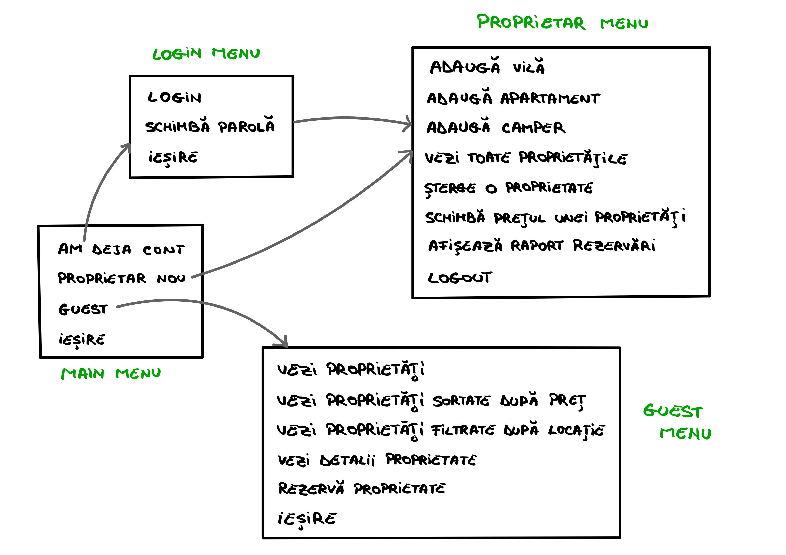

# 🏡 AirbnbManagement

Tema aleasa: Un sistem de management al proprietatilor date spre inchiriere pe termen scurt, asemanator cu Airbnb.

---

## 📦 Clase

### 👤 Proprietar
- id_proprietar: int  
- nume: String  
- email: String  
- parola: String  

### 🏠 Proprietate (clasa abstracta)
- id_proprietate: int
- id_proprietar: int 
- denumire: String  
- locatie: String  
- capacitate: int  
- disponibila: boolean  
- pretPeNoapte: double  

#### 🏢 Apartament (mosteneste Proprietate)
- etaj: int  
- areBalcon: boolean  

#### 🏡 Vila (mosteneste Proprietate)
- suprafataGradina: double  
- arePiscina: boolean  

#### 🚐 Camper (mosteneste Proprietate)
- lungime: double  
- autonomieApa: int (in zile)

### 🛎️ Rezervare
- id_rezervare: int  
- propritate: Proprietate  
- dataStart: LocalDate  
- dataEnd: LocalDate  
- costTotal: double  
- status: Status (enum)

  ### 👁️ Vizualizare  
- nume_proprietate: String    
- id_proprietar: int  
- dataVizualizare: LocalDateTime    


### 🧾 Enum Status

```java
public enum Status {
    ANULATA,
    CONFIRMATA,
    ACHITATA
}
```

## 🧭 Meniu  



### 🔌 Persistenta datelor – JDBC

Sistemul folosește JDBC (Java Database Connectivity) pentru interacțiunea cu baza de date.

- Am definit un **DAO generic de bază (`BasicDAO`)** cu operații CRUD:  
  - `create(T entity)`  
  - `read(int id)`  
  - `update(T entity)`  
  - `delete(int id)`  
  - `readAll()`

Clasele DAO concrete implementează această interfață: `ProprietarDAO`, `VilaDAO`, `CamperDAO`, `ApartamentDAO`.
- Suplimentar, am implementat și operații de citire pentru `RezervareDAO`.
- Clasele DAO sunt implementate folosind **pattern-ul Singleton** pentru a garanta că există o singură instanță a fiecărui DAO pe durata rulării aplicației.
- Pentru unele entități, am adăugat **metode suplimentare** în DAO-uri pentru a acoperi cerințe specifice (ex. găsirea tuturor proprietăților pentru un proprietar anume).

Conexiunea cu baza de date este gestionată prin clasa `DatabaseConfiguration`, care implementează un singleton pentru conexiunea JDBC folosind `DriverManager`.
- `printStackTrace()` afișează detalii despre eroarea SQL, utile pentru depanare.
- `PreparedStatement` este folosit pentru a construi și executa instrucțiuni SQL cu parametri siguri.
- `executeUpdate()` execută instrucțiuni care modifică datele în DB și întoarce numărul de rânduri modificate.

## ⚙️ Servicii

Aplicatia este structurata pe patru servicii principale, fiecare responsabil de gestionarea unei entitati din sistem:

- **ProprietarService**  
  Gestioneaza operatiile legate de proprietari: creare, actualizare, stergere si cautare. De asemenea, poate valida datele si asigura securitatea accesului(login).

- **ProprietateService**  
  Se ocupa de administrarea proprietatilor (Apartament, Vila, Camper). Include metode pentru adaugarea, modificarea si stergerea proprietatilor, precum si pentru cautarea acestora dupa diferite criterii (ex.proprietar, pret).

- **VizualizareService**  
  Inregistreaza si gestioneaza istoricul vizualizarilor proprietatilor de catre utilizator, facand o recomandare la rezervare.

- **RezervareService**  
  Administreaza rezervarile facute pentru proprietati, incluzand crearea si validarea disponibilitatii.

Fiecare serviciu foloseste DAO-urile aferente pentru accesul la date.
Am implementat serviciile ca **Singleton**.

## 📚 Colectii folosite

In `VizualizareService` am folosit **TreeSet** pentru a stoca obiectele de tip `Vizualizare`.  
- Am ales **TreeSet** deoarece pastreaza elementele sortate automat, iar pentru asta clasa `Vizualizare` implementeaza interfata `Comparable`.  
- Aceasta structura ne permite sa obtinem rapid ultima vizualizare pentru recomandare.

Pentru gestionarea diferitelor tipuri de proprietati (`Vila`, `Apartament`, `Camper`), am folosit o colectie de tip **`List<Proprietate>`**.  
- Aceasta colectie permite **polimorfismul**, deoarece toate clasele mostenesc clasa abstracta `Proprietate`, permitand manipularea lor in lista indiferent de tipul concret.


